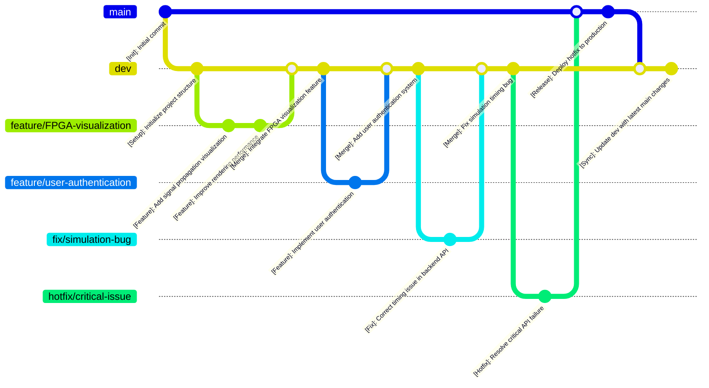

# **Best Practices – Web FPGA Simulator (Team 7)**

## **1️⃣ General Coding Guidelines**
To ensure code quality, maintainability, and team collaboration, all developers must follow these best practices:

- **Always write code in English** → Variable names, comments, and commit messages must be in English.
- **Follow a consistent code style** → Use uniform indentation and naming conventions across the project.
- **Use meaningful commit messages** → Every commit should describe **what changed and why** (see Git section).
- **Keep documentation updated** → Update relevant docs at every stage of development.
- **Test all code before pushing to GitHub** → Ensure everything works **before merging** into the main branch.
- **Communicate proactively** → Inform the team about blockers and progress via Slack or GitHub Issues.

---

## **2️⃣ Git Workflow**
### **Commit Messages**
Every commit should be **clear, concise, and descriptive**. Follow this format:

```
[Type]: Short description

[Optional] Longer description if needed.
```

✅ **Good Examples:**
```
[Feature]: Add signal propagation visualization
[Docs]: Update README with new features
[Fix]: Correct timing issue in backend API
[Test]: Add unit tests for simulation controller
```

❌ **Bad Examples:**
```
Update frontend
README changes
Fix bug
Add tests
```

### **Branching Strategy**
We follow the **Git Flow** strategy:



- **`main`** → The stable production branch.
- **`dev`** → The main development branch.
- **`feature/branch-name`** → For new features.
- **`fix/branch-name`** → For bug fixes.
- **`hotfix/branch-name`** → For urgent fixes in `main`.

### **Pull Request Guidelines**
- Always **create a PR** before merging into `dev` or `main`.
- The PR description must include:
  - A summary of changes.
  - A reference to the Trello card or GitHub Issue (if applicable).
- **Assign 2 reviewers** for every PR.

## **3️⃣ Code Style**
### **Indentation & Formatting**
- Use **4 spaces for indentation** (equivalent to one tab).
- **Max line length: 100 characters**.
- Keep **consistent spacing** in function definitions.

### **Naming Conventions**
✅ **Variables & Functions** → Use **camelCase** for JavaScript, **snake_case** for Python.
```js
let signalPropagationSpeed = 10;  // ✅ Good (camelCase)
let signal_propagation_speed = 10; // ❌ Bad (use snake_case in Python only)
```

✅ **Constants** → Use **UPPER_CASE_WITH_UNDERSCORES**.
```js
const MAX_SIMULATION_SPEED = 5;
```

✅ **Classes** → Use **PascalCase**.
```js
class SignalVisualizer {
  constructor() { }
}
```

✅ **File Names**
- **Frontend:** `camelCase.js` (`simulationController.js`)
- **Backend:** `snake_case.py` (`signal_handler.py`)

### **Comments**
📂 **Documentation**
- Use **docstrings** for Python.
```python
def calculate_signal_delay(time, distance):
    """
    Calculates the delay of a signal propagation.

    Parameters:
    time (float): Time in nanoseconds
    distance (float): Distance in micrometers

    Returns:
    float: Signal delay in nanoseconds
    """
```
- Use **JSDoc for JavaScript**.
```js
/**
 * Simulates the FPGA signal propagation.
 * @param {number} speed - Simulation speed factor.
 */
function runSimulation(speed) { }
```

### **Error Handling**
- Always **handle errors** with try-catch blocks.
- **Log errors** with a clear message.
```js
try {
  // Code that may throw an error
} catch (error) {
  console.error('Error in runSimulation:', error);
}
```

---

## **4️⃣ Documentation**
### **How to Write Documentation**
1. **Write all documentation in English**.
2. **Keep it clear and structured** with proper header, sections, and sub-sections.
3. **Use a consistent format** for all documents.
4. **Footer with Team, Glossary, and Version History**.
5. **Update it frequently** → Documentation must evolve with the code.
6. **Use diagrams and visuals** to explain complex concepts.
7. **Include code snippets** for better understanding.

#### Header Template
```markdown
<div align="center">

# Functional Specifications 

---
**Title:** Web FPGA - Functional Specifications

**Team:** Team 7

**Author:** Aurélien Fernandez

**Version:** 1.3

---

</div>

<br><details>
<summary><h2 id="toc"> Table of Contents <i>(Click to expand)</i></h2></summary>
(Write The beginning of the table of contents here, then let [Markdown All in One](https://marketplace.visualstudio.com/items?itemName=yzhang.markdown-all-in-one) generate the rest)
</details>
```

#### Section Template
```markdown
## 1. Introduction
Lorem ipsum dolor sit amet, consectetur adipiscing elit. Nullam nec purus et nunc ultricies ultricies. Donec auctor, nunc nec

### 1.1 Purpose
Lorem ipsum dolor sit amet, consectetur adipiscing elit. Nullam nec purus et nunc ultricies ultricies. Donec auctor, nunc nec

### 1.2 Scope
Lorem ipsum dolor sit amet, consectetur adipiscing elit. Nullam nec purus et nunc ultricies ultricies. Donec auctor, nunc nec
```


### **Where to Store Documentation**
📂 **Documents/** *(Main project documentation)*
- `FunctionalSpecifications/` → Functional requirements.
- `TechnicalSpecifications/` → Technical related documents.
- `QA/` → Testing plan and test cases.
- `Management/` → Management related documents.

---

## **5️⃣ Project Structure**
Maintaining a clear project structure ensures **organization and efficiency**.

```
.
├── Code
│   ├── Backend/        # Backend logic (API, data processing)
│   ├── Frontend/       # Frontend UI and visualization
├── Documents
│   ├── FunctionalSpecifications/  # Functional specs
│   ├── TechnicalSpecifications/   # Technical specs
│   ├── QA/                        # Test plans & test cases
│   ├── Management/                 # Management docs
├── Scripts/          # Installation and execution scripts
├── LICENSE.md        # License file
├── README.md         # Project overview
├── .gitignore        # Ignore unnecessary files
```

- **Backend** → Contains the server-side logic.
  - `api/` → API endpoints.
  - `models/` → Data models.
  - `tests/` → Unit tests.

- **Frontend**  → Contains the client-side logic.
  - `pages/` → Main UI pages.
  - `components/` → UI components.
  - `services/` → API calls.
  - `utils/` → Helper functions.

---

## **✅ Summary**
✔ **Use Git Flow for branch management**  
✔ **Write meaningful commit messages**  
✔ **Follow clear code style guidelines**  
✔ **Keep documentation structured and updated**  
✔ **Maintain a clean project structure**